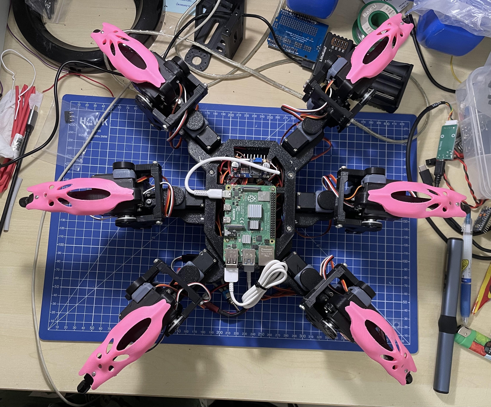
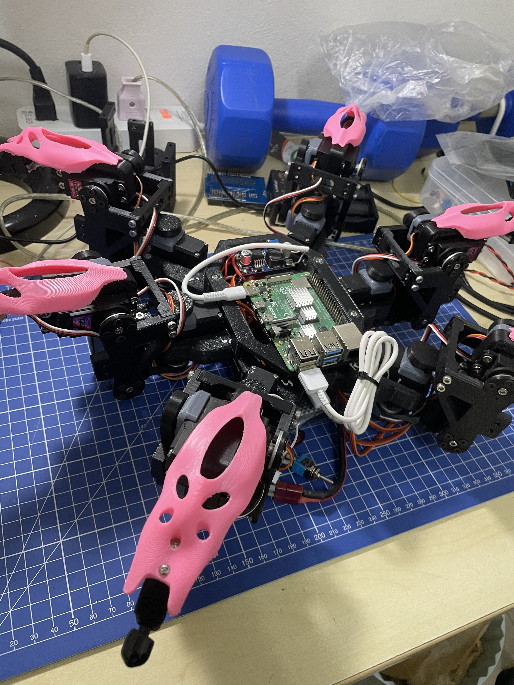
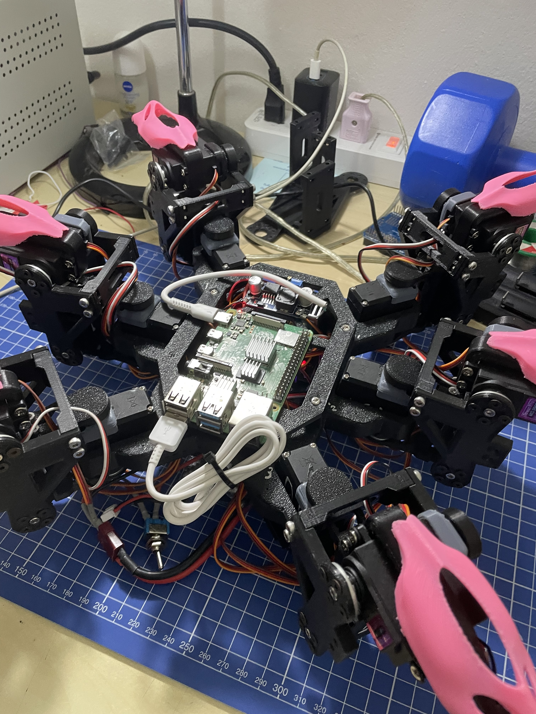

This is my code for the my hexapod using [Chipo](https://www.youtube.com/watch?v=x_bK-sp6V40&t=58s)'s frame from [Make Your Pet](https://github.com/MakeYourPet)

The servo driver is found here [Eddie's Repository](https://github.com/EddieCarrera/chica-servo2040-simpleDriver)

Hexapod Assembled:

